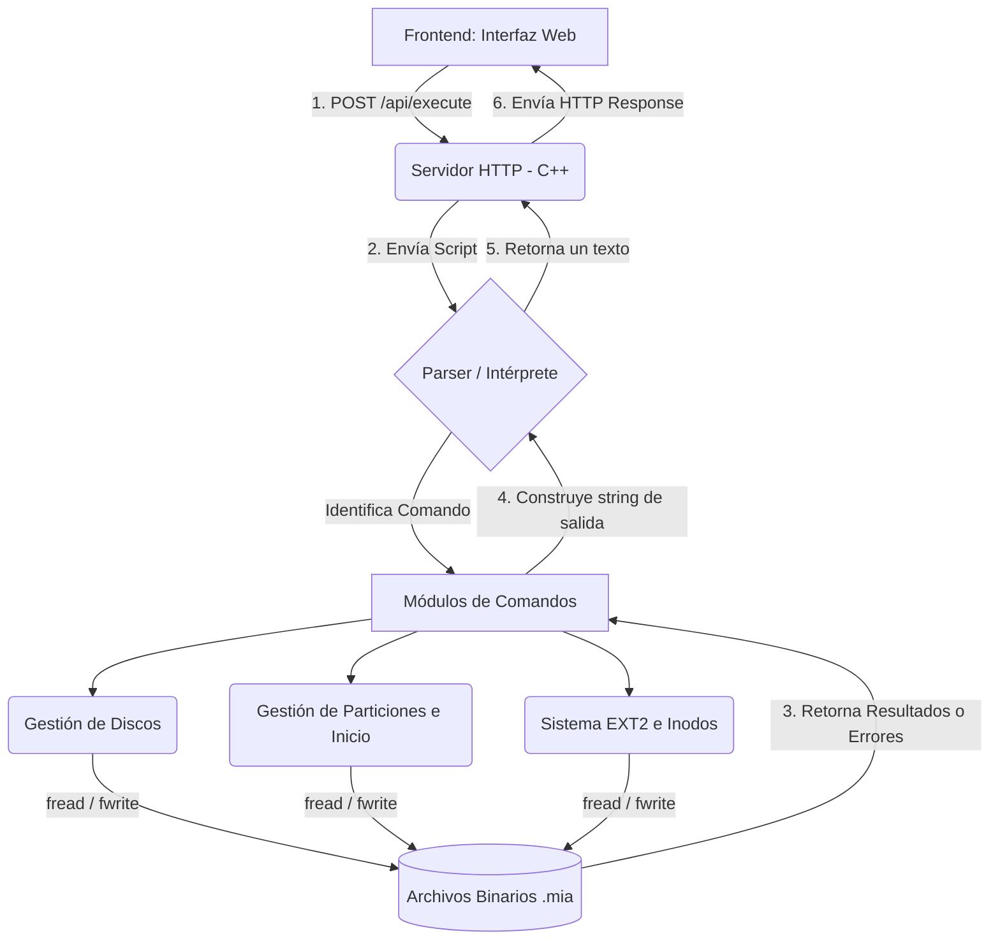

# Manual Técnico - Simulación de Sistema de Archivos EXT2

Este manual técnico brinda una visión completa del funcionamiento interno y uso del sistema de archivos EXT2 simulado en esta aplicación web, detallando su arquitectura, el manejo de estructuras en memoria y los comandos implementados.

---

## 1. Descripción de la Arquitectura del Sistema

La aplicación está diseñada bajo una arquitectura **Cliente-Servidor** clásica, dividiéndose lógicamente en dos áreas que se comunican mediante peticiones HTTP asíncronas.

### Integración Frontend - Backend
- **Frontend (Interfaz de Usuario)**: Construido puramente con HTML, CSS y JavaScript. Actúa como el cliente. Proporciona un editor de texto o consola donde el usuario ingresa sus comandos. Al presionar "Ejecutar", el script de JS agrupa el texto y lo envía mediante una petición `POST` al endpoint `/api/execute` del servidor.
- **Backend (Servidor y Lógica de Archivos)**: Desarrollado en **C++17**. Utiliza la librería `cpp-httplib` para exponer el servidor web en el puerto `8080` y recibir comandos. Una vez que llega el texto, el servidor invoca al analizador (`parser.cpp`), el cual se encarga de tokenizar cada línea e identificar qué comando debe ser ejecutado en el sistema binario.

### Diagrama de Flujo
A continuación, se muestra el ciclo de vida de una petición dentro de la aplicación:

---

## 2. Explicación de las Estructuras de Datos

Para que el programa de C++ interactúe correctamente simulando un disco real, todas las estructuras lógicas de EXT2 están modeladas mediante **strutcs con atributos empaquetados** (`__attribute__((packed))`). Esto previene el *padding* (relleno de memoria), logrando que los bytes que se escriben calcen matemáticamente con el tamaño planeado para el archivo binario (`.mia`).

### A) Master Boot Record (MBR) y Extended Boot Record (EBR)
- **MBR**: Es una estructura de unos 153 bytes que **siempre se sitúa en el byte 0** de cualquier archivo de disco. Define el tamaño total del disco, la fecha de creación, la firma de identificación y posee un arreglo de 4 estructuras **Partition** (particiones primarias o la única extendida autorizada).
- **EBR**: Se encuentra exclusivamente al inicio de cada **Partición Lógica**. Está diseñado en forma de lista enlazada; cada EBR guarda la información de la partición lógica que le sucede, y también almacena el byte específico donde se encuentra el "Siguiente EBR" (`part_next`).

### B) Superbloque (SuperBlock)
El Superbloque es la cabecera del sistema de archivos de nivel superior (EXT2). Solo se crea cuando se ejecuta un formateo (comando `mkfs`). 
- **Función**: Almacena de manera global y consolidada cuántos inodos y bloques existen dentro de la partición formateda, cuántos de ellos están libres, cuál es el *Magic Number* (0xEF53) para identificar la validez del disco y en qué bytes específicos del disco arrancan los bitmaps y las tablas de datos.

### C) Inodos (`Inode`)
Un inodo es el registro maestro descriptivo de un archivo o carpeta; NO guarda contenido directo, guarda "Metadatos".
- **Función**: Define quién es el propietario actual (uid/gid), tamaño real, fechas de creación/modificación/lectura y los permisos.
- **Apuntadores**: Contiene un vector de 15 enteros (`i_block[15]`). Los primeros 12 son apuntadores directos hacia sub-bloques reales. El inodo 13 apunta a un *PointerBlock* de indirección simple, el 14 a indirección doble y el 15 a indirección triple.

### D) Clases de Bloques
Los bloques representan el fin de la cadena organizativa y es donde se guarda la data tangible.
- **Bloques de Carpeta (`FolderBlock`)**: Contienen información relacional estructural. Tienen 4 sub-estructuras (`Content`) dentro. Cada *Content* indica el nombre de un enlace hijo o subcarpeta y dice en qué inodo se debe buscar a ese hijo.
- **Bloques de Archivo (`FileBlock`)**: Arreglos crudos de 64 caracteres. Es de aquí de donde programas como `cat` extraen la información de los textos.
- **Bloques de Apuntadores (`PointerBlock`)**: Bloques de transición. Contienen vectores de 16 posiciones de datos enteras apuntando recursivamente a inodos o a otros bloques.

---

## 3. Descripción de los Comandos Implementados

La aplicación cuenta un extenso motor de sintaxis por comandos. Abajo se describe su comportamiento, sus efectos en el archivo y sus parámetros.

### Administración de Discos y Particionamiento
* **`mkdisk`**
  - **Descripción**: Crea el archivo binario simulando un disco duro. Rellena el archivo con ceros (`0x00`) usando un buffer e inicializa en el byte inicial (offset 0) las estructuras nulas del `MBR`.
  - **Parámetros**: `-size` (tamaño en la unidad indicada), `-unit` (`k`, `m`), `-path` (ruta al archivo en la máquina local), `-fit` (`bf`, `ff`, `wf`).
  - **Ejemplo**: `mkdisk -size=50 -unit=M -fit=FF -path=/home/user/Disco.mia`
* **`rmdisk`**
  - **Descripción**: Elimina físicamente el archivo `.mia` de Linux usando librerías de `cstdio` o `sys/stat`.
  - **Parámetros**: `-path` (ruta exacta al archivo).
  - **Ejemplo**: `rmdisk -path=/home/user/Disco.mia`
* **`fdisk`**
  - **Descripción**: Modifica el `MBR` o inserta `EBRs` dentro del archivo `.mia` limitando márgenes de inicio y tamaño.
  - **Parámetros**: `-type` (`P` primaria, `E` extendida, `L` lógica), `-unit`, `-name`, `-size`, `-path`, `-fit`.
  - **Ejemplo**: `fdisk -type=P -unit=m -name=Part1 -size=10 -path=/home/user/D1.mia`

### Montaje y Sistema de Archivos
* **`mount`**
  - **Descripción**: Lee el `MBR` del archivo designado, busca la partición por nombre coincidente y las marca en la tabla de memoria RAM de particiones activas asignándole su ID transitorio referencial. Efecto interno temporal, las letras inician en `a-z` y números como identificadores numéricos.
  - **Parámetros**: `-path`, `-name`.
  - **Ejemplo**: `mount -path=/home/user/D1.mia -name=Part1`
* **`mkfs`**
  - **Descripción**: Formatea la partición montada e instancia las estructuras EXT2 en el bloque correspondiente. Inserta e inicializa el `SuperBlock`, Bitmaps, inodo raíz `/` y los inodos iniciales (`users.txt` predeterminado).
  - **Parámetros**: `-id` (ID generado en memoria mediante `mount`), `-type` (`Full`).
  - **Ejemplo**: `mkfs -type=full -id=191A`

### Autenticación y Administración de Usuarios/Archivos
Para usar comandos transaccionales (carpetas de usuario e inserción), debe haber un id de inicio de sesión de fondo persistido globalmente en RAM:
* **`login`**: Recorre el inodo pertinente al archivo `/users.txt` en el ID de partición y evalúa las cadenas para confirmar que las credenciales cuadran. Si logran entrar, el `uid` en la RAM y `gid` entran en actividad. `login -user=root -pass=123 -id=191A`
* **`logout`**: Elimina del entorno de C++ la tupla persistida en memoria desvinculando cualquier operación de escritura/lectura posterior a un dueño.
* **`mkdir`** y **`mkfile`**:
  - **Descripción**: Reservan dentro de los *bitmaps* nuevas posiciones en *true*, construyen/desplegan sus `Inodes` enlazándolos con bloques (`FolderBlock` o `FileBlock`) guardando tamaños actualizados y metidas recursivas con apuntadores y *Bitmaps*.
  - **Parámetros (`mkfile`)**: `-path`, `-size`, `-cont` (referencia a un `.txt` externo para volcar su texto dentro del *FileBlock*). `-r` (para auto-crear carpetas faltantes).
* **`cat`**
  - **Descripción**: Imprime el contenido leyendo directamente sus File Blocks concatenados. `cat -file1=/test.txt`.

### Comandos de Reportes
* **`rep`**
  - **Descripción**: Permite generar documentación externa (.jpg, .png, text, tree diagramas). Usa recursividad in-order en árboles lógicos para Graphviz (dot commands) o imprime crudos.
  - **Efectos en Sistema**: Ninguno (Comando de Solo Lectura).
  - **Parámetros principales**: `-name` (mbr, inodo, bloque, bm_inode, etc), `-path`, `-id`.
  - **Ejemplo**: `rep -id=191A -path=/home/rept.jpg -name=bm_inode`
